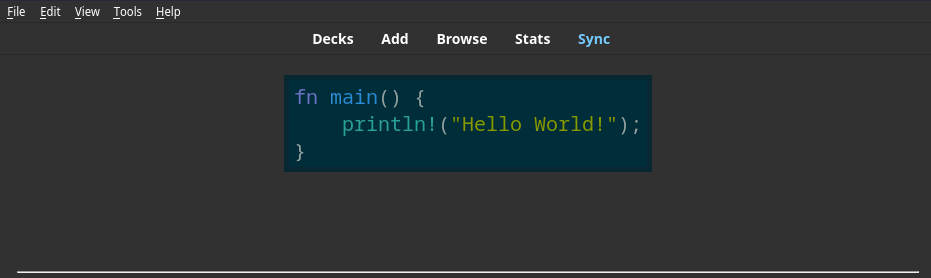

<h2 align="center">Copy2Clipboard(html2text) Add-on for Anki</h2>

<p align="center">
<a title="License: GPL v3" href="https://www.gnu.org/licenses/gpl-3.0"></a>
<a title="Rate on AnkiWeb" href="https://ankiweb.net/shared/info/703825446"></a>
<br>
</p>

Copy2Clipboard(html2text) automatically copies a field's content to the clipboard when the question or answer side is shown (or both, if desired).

## How is this add-on different from [Copy2Clipboard](https://ankiweb.net/shared/info/1525025114)?

This add-on is built on [Copy2Clipboard](https://ankiweb.net/shared/info/1525025114). I simply bundled [html2text](https://github.com/Alir3z4/html2text) to convert HTML to Markdown-formatted text.

The original Copy2Clipboard copies the underlying html, which is probably not what you want. For example, given the following front side:



the following content is copied:

```html
<pre style="display:flex; justify-content:center;"><code class="language-rust hljs"><span class="hljs-keyword">fn</span> <span class="hljs-title function_">main</span>() {
&nbsp;&nbsp;&nbsp; <span class="hljs-built_in">println!</span>(<span class="hljs-string">"Hello World!"</span>);
}</code></pre>
```

With this add-on, the following is copied:

```rust
    fn main() {
        println!("Hello World!");
    }
```

## Default behavior

When the question side is shown: "Front" field will be copied to the clipboard (if one exists).

When the answer side is shown: nothing will be copied to the clipboard.

To modify the default behavior, go to Tools -> Add-ons -> Choose `Copy2Clipboard(html2text)` -> Click `Config` -> edit `"questionField"` and `"answerField"` according to your needs

## Installation through AnkiWeb

The easiest way to install Copy2Clipboard(html2text) is through [AnkiWeb](https://ankiweb.net/shared/info/703825446).

## License and Credits

This add-on would not have been possible without [html2text](https://github.com/Alir3z4/html2text) and [Copy2Clipboard](https://ankiweb.net/shared/info/1525025114). This program is distributed in the hope that it will be useful, but without any warranty.
